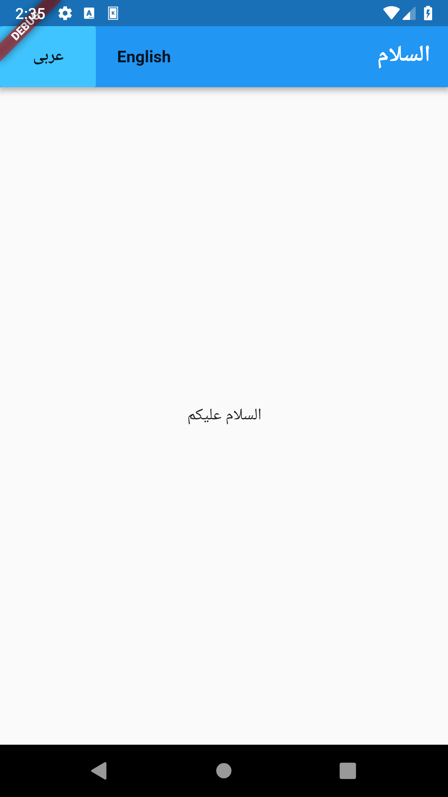
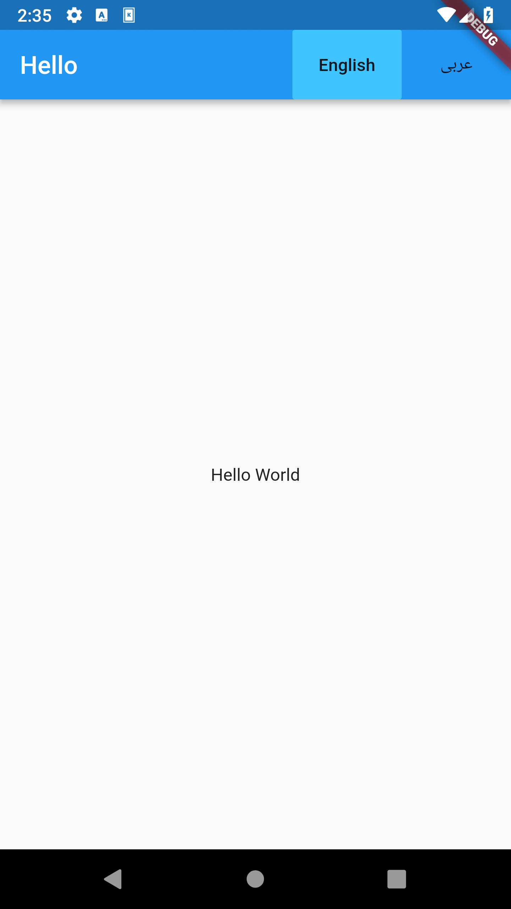

# easy_localization

Easy and Fast internationalizing your Flutter Apps

## Getting Started

## Why easy_localization?

simplify the internationalizing process in Flutter .
Internationalization by Using JSON Files .

### Configuration

you must create a folder in your project's root: the `path`. Some examples:

> /assets/"langs" , "i18n", "locale" or anyname ...
>
> /resources/"langs" , "i18n", "locale" or anyname ...

Inside this folder, must put the _json_ files containing the translated keys :

> `path`/{languageCode}.json

must declare the subtree in your **_pubspec.yaml_** as assets:

```yaml
flutter:
  assets:
    - {`path`/{languageCode}.json}
```

The next step :

```dart
import 'package:flutter/material.dart';
import 'package:flutter_localizations/flutter_localizations.dart';
import 'package:easy_localization/easy_localization.dart';

void main() => runApp(LocaleInherited(child: MyApp()));

class MyApp extends StatelessWidget {
  @override
  Widget build(BuildContext context) {
    var data = LocaleProvider.of(context).data;
    return LocaleProvider(
      data: data,
      child: MaterialApp(
        title: 'Flutter Demo',
        localizationsDelegates: [
          GlobalMaterialLocalizations.delegate,
          GlobalWidgetsLocalizations.delegate,
          //app-specific localization
          EasylocalizationDelegate(
              locale: data.locale ?? Locale('en'), path: 'resources/langs'),
        ],
        supportedLocales: [Locale('en'), Locale('ar')],
        locale: data.locale,
        theme: ThemeData(
          primarySwatch: Colors.blue,
        ),
        home: MyHomePage(title: 'Easy localization'),
      ),
    );
  }
}

class MyHomePage extends StatefulWidget {
  MyHomePage({Key key, this.title}) : super(key: key);

  final String title;

  @override
  _MyHomePageState createState() => _MyHomePageState();
}

class _MyHomePageState extends State<MyHomePage> {
  @override
  Widget build(BuildContext context) {
    var data = LocaleProvider.of(context).data;
    return LocaleProvider(
      data: data,
      child: Scaffold(
        appBar: AppBar(
          title: Text(AppLocalizations.of(context).trans('title')),
          actions: <Widget>[
            FlatButton(
              child: Text("English"),
              color: Localizations.localeOf(context).languageCode == "en"
                  ? Colors.lightBlueAccent
                  : Colors.blue,
              onPressed: () {
                this.setState(() {
                  data.changeLocale(Locale("en"));
                  print(Localizations.localeOf(context).languageCode);
                });
              },
            ),
            FlatButton(
              child: Text("عربى"),
              color: Localizations.localeOf(context).languageCode == "ar"
                  ? Colors.lightBlueAccent
                  : Colors.blue,
              onPressed: () {
                this.setState(() {
                  data.changeLocale(Locale("ar"));
                  print(Localizations.localeOf(context).languageCode);
                });
              },
            )
          ],
        ),
        body: Center(
          child: Text(AppLocalizations.of(context).trans('msg')),
        ),
      ),
    );
  }
}

```

## Screenshots

<td style="text-align: center">

</td>

<td style="text-align: center">

</td>


This project is a starting point for a Dart
[package](https://flutter.io/developing-packages/),
a library module containing code that can be shared easily across
multiple Flutter or Dart projects.

For help getting started with Flutter, view our
[online documentation](https://flutter.io/docs), which offers tutorials,
samples, guidance on mobile development, and a full API reference.
