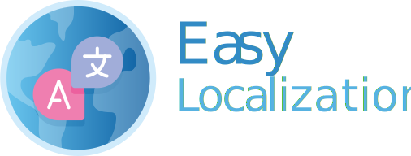

<p align="center"></p>
<h1 align="center"> 
Easy and Fast internationalization for your Flutter Apps
</h1>


## Why easy_localization?

- 🚀 Easy translations for many languages
- 🔌 Load translations as JSON, CSV, Yaml, Xml using [Easy Localization Loader](https://github.com/aissat/easy_localization_loader)
- 💾 React and persist to locale changes
- ⚡ Supports plural, gender, nesting, RTL locales and more
- ⁉️ Error widget for missing translations
- ❤️ Extension methods on `Text` and `BuildContext`
- 💻 Code generation for localization files and keys.
- 👍 Uses BLoC pattern 

## Getting Started

### Installation

Add to your `pubspec.yaml`:

```yaml
dependencies:
  easy_localization: <last_version>
```


Add translation files as local assets to `path`, e.g:

```
/assets/translations
```

Add translation files like this

```
{path}/{languageCode}.{ext}
{path}/{languageCode}-{countryCode}.{ext}
```

Example:

```
/assets/translations/en.json
/assets/translations/en-US.json
```

Declare your assets localization directory in `pubspec.yaml`:

```yaml
flutter:
  assets:
    - assets/translations/
```

### Loading translations from other resources

You can use JSON,CSV,HTTP,XML,Yaml files, etc.

See [Easy Localization Loader](https://github.com/aissat/easy_localization_loader) for more info.

### Note on **iOS**

For translation to work on **iOS** you need to add supported locales to 
`ios/Runner/Info.plist` as described [here](https://flutter.dev/docs/development/accessibility-and-localization/internationalization#specifying-supportedlocales).

Example:

```xml
<key>CFBundleLocalizations</key>
<array>
	<string>en</string>
	<string>nb</string>
</array>
```

### Configuration app

Add EasyLocalization widget like in example

```dart
import 'package:flutter/material.dart';
import 'package:flutter_localizations/flutter_localizations.dart';
import 'package:easy_localization/easy_localization.dart';

void main() {
  runApp(
    EasyLocalization(
      supportedLocales: [Locale('en', 'US'), Locale('de', 'DE')],
      path: 'assets/translations',
      fallbackLocale: Locale('en', 'US'),
      child: MyApp()
    ),
  );
}

class MyApp extends StatelessWidget {
  @override
  Widget build(BuildContext context) {
    return MaterialApp(
      localizationsDelegates: context.localizationDelegates,
      supportedLocales: context.supportedLocales,
      locale: context.locale,
      home: MyHomePage()
    );
  }
}
```

[**Full example**](https://github.com/aissat/easy_localization/blob/master/example/lib/main.dart)

## Usage

### Change Locale:

```dart
context.locale = locale;
```

## Code generation

Code generation keys supports json files, for more information run in terminal `flutter pub run easy_localization:generate -h`

### Localization asset loader class

Example:

```
4. All done!

### Localization keys

If you have many localization keys and are confused, key generation will help you. The code editor will automatically prompt keys

Steps:
1. Open your terminal in the folder's path containing your project 
2. Run in terminal `flutter pub run easy_localization:generate -f keys -o locale_keys.g.dart`
3. Past import.

```dart
import 'generated/locale_keys.g.dart';
```

#### Code generation

Run `flutter pub run easy_localization:generate -h` for help.

## Screenshots

 Arabic RTL | English LTR | Error widget
--- | --- | ---
||

## Donations

We need your support. Projects like this can not be successful without support from the community. If you find this project useful, and would like to support further development and ongoing maintenance, please consider donating.

<p align="center">
  <a href="https://opencollective.com/flutter_easy_localization/donate" target="_blank">
    
  </a>
</p>

### Sponsors


### Contributors thanks


<a href="https://github.com/aissat/easy_localization/graphs/contributors"></a>
